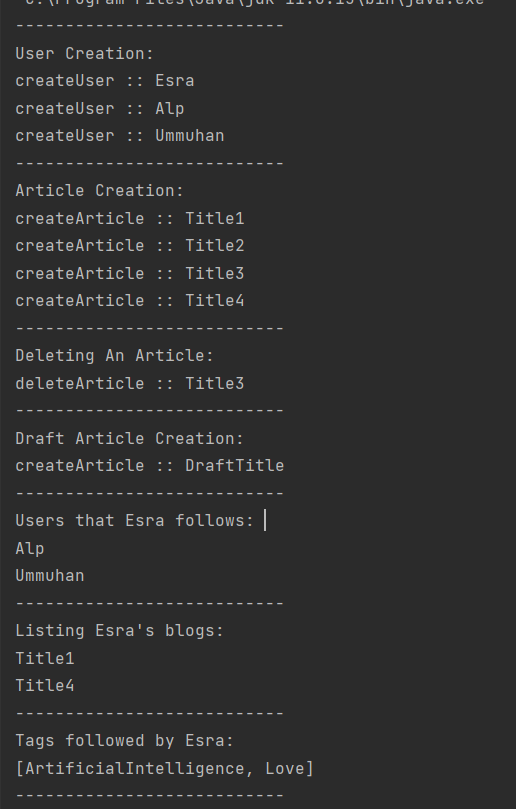
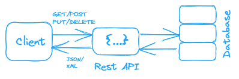

**1. medium.com web sitesinin Object Modellemesini yapınız.**  
**Output**  
  
---
**2. Creational Design Pattern’lar incelenmelidir. Örneklerle anlatınız.**  
Creational tasarım desenleri; Esnekliği ve mevcut kodun yeniden kullanımını artıran nesne oluşturma mekanizmaları sağlar.  

Creational Design Patterns
- Singleton: O sınıfın runtimedayken sadece bir instance'ini oluşturur.
- Factory Method: Bir sınıfın typlerini direkt olarak vermeden instanslarını verebilecek metod.
- Abstract Factory:  Kompleks objeleri yaratmak için kullanılan bir pattern
- Builder: Bir grup nesnesi yaratmak için oluşturulan pattern
- Prototype: Var olan bir nesneden yeni bir nesne yaratmak için oluşturulur.

**Singleton**  
Amaç bir class’tan sadece bir instance yaratılmasını sağlamaktır. Yani herhangi bir class’tan bir instance 
yaratılmak istendiğinde, eğer daha önce yaratılmış bir instance yoksa yeni yaratılır. Daha önce yaratılmış
ise var olan instance kullanılır. Builder, Prototype, Abstract Factory gibi tasarım desenlerini oluşturur.
Singleton sınıf kavramı, bir sınıf için nesne sayısını sınırlamaya ihtiyaç duyulan durumlar için kullanışlıdır.
````java
public class A {
    private A() {}

    private static final A instance = new A();

    public static A getInstance(){
        return instance;
    }
    public void print(){
        System.out.println("Singleton class print method");
    }
}
````
````java
public class Main {
    public static void main(String[] args) {
        A obj = A.getInstance();
        obj.print();
    }
}
````
Output  
````
Singleton class print method
````
İlk çağrıldığında bir kez çalışacak daha sonra tekrar çağrılamadığı için hep aynı nesneyi kullanmış olacaktır.
Yukarıdaki yaklaşımda nesneyi kullanmadan önce yaratır. 
Thread Safe Singleton uyulaması;  
Birden fazla thread'in birden fazla örnek oluşturmasını engellemenin en kolay yolu, global erişim yöntemini 
'synchronized ' yapmaktır.

````java
public class A {
    private A() {}

    private static A instance;


    public static A getInstance(){
        if(instance == null){
            synchronized (A.class){
                if(instance == null){
                    instance = new A();
                }
            }
        }
        return instance;
    }
    public void print(){
        System.out.println("Singleton class print method");
    }
}

````
Output
````
Singleton class print method
````
**Factory Method**  
Bu design pattern için bir örnek üzerinden gidelim. Diyelim ki bir interfacemiz var.
Ve bu interface'i implement eden bir kaç class var. Ve bu interface'in altında farklı farklı type mevcut. 
Her zaman o type adı ile erişmek istenmeyebilir. Aynı interface'i implement eden sınıfların yaratılma detaylarını
saklayan, istenilen sınıfın instance'ını yaratan bir factory class yaratılır. Böylece üst sınıfta nesneler oluşturmak 
için sağlanan interfaceden alt sınıfların nesnelerinin türünün değişmesine izin verilmeyen bir yapı oluşturulmuş olur.
Yaratıcı class ile nesneler arasındaki sıkı bağ yerini gevşek bağa bırakır.

```java
public class User { 
   //user information
}
```

```java
public interface INotify { 
    void sendNotification(User user); 
}
```

```java
public class MailNotify implements INotify { 
    @Override 
    public void sendNotification(User user) {
        System.out.println("Email sent. "); 
    } 
}
```

```java
public class SmsNotify implements INotify { 
    @Override 
    public void sendNotification(User user) {
        System.out.println("SMS sent. "); 
    } 
}
```

```java
public class NotifyFactory { 
    public INotify CreateNotify(String notifyType) { 
        if (notifyType == "SMS") {
            return new SmsNotify(); 
        } else if (notifyType == "MAIL") {
            return new MailNotify(); 
        } 
        return null; 
    } 
}
```
```java
public class App { 
    public static void main(String[] args) { 
        NotifyFactory notifyFactory = new NotifyFactory(); 
        INotify notify = notifyFactory.CreateNotify("SMS"); 
        notify.sendNotification(new User()); 
    } 
}
```
Output
````
SMS sent.
````
**Abstract Factory**  
Abstract Factory, Factory design pattern'ine bir soyutlama daha getirmiş olur. Birbiri ile alakalı sınıfların 
nesnesini oluşturmak için kullanılır. Somut Sınıflarını belirtmeden ilgili nesnelerin ailelerini üretmenize
izin veren design pattern'dir.

Abstract Factory, ürün ailesinin her sınıfından nesneler oluşturmak için bir interface sağlar. Kod bu interface aracılığıyla
nesneler oluşturduğu sürece, uygulama tarafından halihazırda oluşturulmuş ürünlerle eşleşmeyen bir ürünün yanlış
varyantını oluşturma konusuna çözüm olmuş olur.


Sistem isteğe bağlı Oracle ya da MySQL için sorgu çalıştırabilir olsun. Bu işlemler için temel olarak da bağlantının 
açılması, kapatılması ve sorgunun çalıştırılması gereklidir. Birbirleri ile ilişkili aileden geldikleri için abstract
factory kullanılmıştır.
```java
public class App { 
    public static void main(String[] args) { 
        CustomOperation customOperation = new CustomOperation(new OracleDatabaseFactory()); 
        customOperation.removeById(1); 
    } 
}
```

```java
public abstract class Command { 
    public abstract void executeCommand(String query); 
}
```
```java
abstract class Connection { 
    public abstract Boolean openConnection(); 
    public abstract Boolean closeConnection(); 
}
```

```java
public class CustomOperation { 
    IDatabaseFactory databaseFactory; 
    Connection connection; 
    Command command; 
    public CustomOperation(IDatabaseFactory databaseFactory) { 
        this.databaseFactory = databaseFactory; 
        this.command = databaseFactory.createCommand(); 
        this.connection = databaseFactory.createConnection(); 
    } 
    public void removeById(int id) { 
        connection.openConnection(); 
        command.executeCommand("DELETE ..."); 
        connection.closeConnection(); 
    } 
}
```

```java
interface IDatabaseFactory { 
    Connection createConnection(); 
    Command createCommand(); 
}
```

```java
class MySQLCommand extends Command { 
    @Override 
    public void executeCommand(String query) {
        
    } 
}
```

```java
public class MySQLConnection extends Connection { 
    @Override 
    public Boolean openConnection() {
        return true; 
    } 
    @Override 
    public Boolean closeConnection() {
        return true; 
    } 
}
```

```java
public class MySQLDatabaseFactory implements IDatabaseFactory { 
    @Override 
    public Connection createConnection() { 
        return new MySQLConnection(); 
    } 
    @Override 
    public Command createCommand() { 
        return new MySQLCommand(); 
    } 
}
```

```java
public class OracleCommand extends Command { 
    @Override 
    public void executeCommand(String query) {
    } 
}
```

```java
public class OracleConnection extends Connection { 
    @Override 
    public Boolean openConnection() {
        return true; 
    } 
    @Override 
    public Boolean closeConnection() {
        return true; 
    } 
}
```

```java
public class OracleDatabaseFactory implements IDatabaseFactory { 
    @Override 
    public Connection createConnection() { 
        return new OracleConnection(); 
    } 
    @Override 
    public Command createCommand() { 
        return new OracleCommand(); 
    } 
}
```
**Builder**

Builder deseni birden fazla parçadan oluşan kompleks yapıdaki bir nesnenin oluşturulması sırasında kullanılır.
Bir classı yaratmayı bilen başka bir class mevcuttur. Ve bu komleks sınıfın instancelerı bu class üzerinden 
yaratılabilir. Bu şekilde bir sürü constructor oluşturmak yerine builder sınıfı üzerinden bu nesneleri yaratılabilir.

````java
class Employee{
    private final String firstName;     //required
    private final String lastName;      //required
    private final int age;              //required
    private final int personalId;       //required
    private final String phone;         //optional
    private final String address;       //optional
    private final String mail;          //optional

    public Employee(String firstName, String lastName, int age, int personalId) {
        this(firstName, lastName, age, personalId, "", "");
    }

    public Employee(String firstName, String lastName, int age, int personalId, String phone) {
        this(firstName, lastName, age, personalId, phone, "");
    }

    public Employee(String firstName, String lastName, int age, int personalId, String phone, String address) {
        this(firstName, lastName, age, personalId, phone, address, "");
    }

    public Employee(String firstName, String lastName, int age, int personalId, String phone, String address, String mail) {
        this.firstName = firstName;
        this.lastName = lastName;
        this.age = age;
        this.personalId = personalId;
        this.phone = phone;
        this.address = address;
        this.mail = mail;
    }

    // Getters and setters ...
}
````
````java

class EmployeeWithBuilder {
    private final String firstName;     //required
    private final String lastName;      //required
    private final int age;              //required
    private final int personalId;       // required
    private final String phone;         //optional
    private final String address;       //optional
    private final String mail;          //optional

    static class EmployeeBuilder {
        private final String firstName;    //required
        private final String lastName;     //required
        private final int age;             //required
        private final int personalId;      // required
        private String phone;              //optional
        private String address;            //optional
        private String mail;               //optional

        public EmployeeBuilder(String firstName, String lastName, int age, int personalId) {
            this.firstName = firstName;
            this.lastName = lastName;
            this.age = age;
            this.personalId = personalId;
        }

        public EmployeeBuilder setAddress(String address) {
            this.address = address;
            return this;
        }

        public EmployeeBuilder setPhone(String phone) {
            this.phone = phone;
            return this;
        }

        public EmployeeBuilder setMail(String mail) {
            this.mail = mail;
            return this;
        }

        public EmployeeWithBuilder build() {
            return new EmployeeWithBuilder(this);
        }
    }

    private EmployeeWithBuilder(EmployeeBuilder builder) {
        this.firstName = builder.firstName;
        this.lastName = builder.lastName;
        this.age = builder.age;
        this.personalId = builder.personalId;
        this.phone = builder.phone;
        this.address = builder.address;
        this.mail = builder.mail;
    }

    @Override
    public String toString() {
        return "EmployeeWithBuilder{\n" +
                "firstName='" + firstName + '\'' +
                ",\nlastName='" + lastName + '\'' +
                ",\nage=" + age +
                ",\npersonalId=" + personalId +
                ",\nphone='" + phone + '\'' +
                ",\naddress='" + address + '\'' +
                ",\nmail='" + mail + '\'' + "\n" +
                '}';
    }
}
````
````java
public class Builder {
    public static void main(String[] args) {
        EmployeeWithBuilder employeeWithBuilder = new EmployeeWithBuilder
                .EmployeeBuilder("Esra", "Varlık", 24, 123)
                .setAddress("Turkey")
                .setMail("esra@gmail.com")
                .setPhone("111111111")
                .build();

        System.out.println(employeeWithBuilder.toString());
    }
}
````

**Prototype**  
Yaratılması çok maliyetli olan nesneleri devamlı devamlı yaratmak yerine ilk nesneyi clonlamak için kullanılır. 
Amaç ilgili nesne üzerinden aynı tipte başka bir nesneyi hızlıca üretebilmektir.
````java
public class Prototype implements Cloneable{
   private String filed1;
   private String field2;

	public Protoype(String field1, String field2){
		this.field1 = field1;
		this.field2 = field2;
	}
	
	@Override
	protected Prototype clone(){
		return new Prototype(field1, field2);
	}
}
`````
Nesnelerin referansları aynı olduğu için birinde değişiklik yapıldığında diğerinde de aynı değişiklik olur.
````
	@Override
	protected Prototype clone(){
		Prototype cpy = this;
		return cpy;
	}
````
Yukarıdaki gibi clone metodunu düzenlersek orjinal instance'ında değerleri değişir.
İkinci yolda ise referansları farklı olduğu için yapılan değişiklikler birbirini etkilemez. 
(yani clone() metodu içerisinde newleyerek)

Clonable doğrudan javadan gelen bir interface. Farklı bir interface kullanılıyorsa veya bu interface kullanılmayacaksa
kendi interface'i oluşturulabilir.
````java
interface Copylable<T>{
T copy();
}

````
---
**3. Derste yapılan emlakcepte uygulamasını Singleton ve Factory pattern’larını uygulayın.
   Oluşturulan objeler bu pattern’ler ile oluşturulmalıdır.(Spring içerisinde BeanFactory gibi
   davranmasını bekliyoruz)**
---
**4. Java dünyasındaki framework’ler ve çözdükleri problemler nedir? Kod Örneklendirini de içermelidir.**  
Framework; yazılım geliştirmek için destek/kılavuz görevi görerek, rutin işleri otomatik olarak yaparak,
zaman tasarrufu sağlayan ve kısayollar sunan hızlı bir şekilde uygulama geliştirilmesini sağlayan iskelet yapıdır.
Java'da en sık kullanılan 5 framework açıklanmıştır.

**Spring**  
En yaygın kullanımı web uygulamaları geliştirmektir. Spring MVC, Spring Core, Spring Security, Spring ORM gibi 
tüm modüller kurumsal uygulamalarda kullanılmaktadır.  
Dependency Injection, Spring framework'ün en önemli özelliğidir. Dependency Injection, bir sınıfın bağımlılıklarının 
bir xml dosyasından olduğu gibi dışarıdan enjekte edildiği bir tasarım modelidir. Sınıflar arasında gevşek bağlantı
sağlar.
````java
import org.springframework.boot.SpringApplication;
import org.springframework.boot.autoconfigure.SpringBootApplication;

@SpringBootApplication
public class MyApplication {

    public static void main(String[] args) {
        SpringApplication.run(MyApplication.class, args);
    }
}
````
Yukarıdaki kodda Spring framework'ünün @SpringBootApplication annotation'ını kullanarak bir web uygulamasının 
başlangıç noktasını tanımlar.
````java
@Controller
public class HelloController {

    @RequestMapping("/hello")
    public String sayHello(@RequestParam(value="name", required=false) String name, Model model) {
        model.addAttribute("name", name);
        return "hello";
    }

}
````
Bu kod bir web uygulamasında bir "hello" sayfası oluşturmak için kullanılabilir.
Bu sayfa, bir isim alır ve bu ismi bir sayfa görüntüsünde kullanarak bir hello mesajı gösterir.

**Hibernate**
Veritabanına erişimi kolaylaştıran bir framework, java nesnelerini veritabanı tablolarına eşleyen ORM aracıdır. 
Hibernate, otomatik olarak veritabanı tabloları oluşturma olanağı sağlar. Veri sorgulama ve veri çekme işlemlerini yapar.
Veritabanından bağımsız sorgular üretir. Yani veritabanı değişse bile SQL sorguları yeni veritabanına göre 
değiştirilmek zorunda kalınmaz. Özetle JDBC'ye alternatif denebilir.
  
Hibernate önemli interfaceleri:
- SessionFactory (org.hibernate.SessionFactory)
- Session (org.hibernate.Session)
- Transaction (org.hibernate.Transaction)

````java
import org.hibernate.Session;
import org.hibernate.SessionFactory;
import org.hibernate.Transaction;
import org.hibernate.cfg.Configuration;

public class HibernateExample {

    public static void main(String[] args) {

        SessionFactory factory = new Configuration()
            .configure().buildSessionFactory();
        
        Session session = factory.openSession();
        Transaction transaction = session.beginTransaction();
    
        User user = new User("Esra VARLIK", "esra@gmail.com");
        session.save(user);
    
        transaction.commit();
        session.close();
        factory.close();
    }
}
````
Yukarıdaki kodda Hibernate'ın Configuration sınıfı kullanılarak bir SessionFactory oluşturulur. Veritabanına yeni bir
kayıt eklemek için bir nesne oluşturulur. Oluşturulan nesne veritabanına kaydedilir.

**JSF**  
JavaServer Faces Dinamik web sayfaları oluşturmamızı sağlayan bir Java framework'üdür. JSP’den farklı olarak kullanıcı 
arayüzü sağlanmaktadır. Amaç CSS, JavaScript ve HTML gibi çeşitli istemci tarafına ait teknolojileri kapsüllemektir. 
Struts'a oldukça benzer.

````
<h:form>
   <h:inputText value="#{helloBean.name}" />
   <h:commandButton value="Say Hello" action="#{helloBean.sayHello}" />
</h:form>
<h:outputText value="#{helloBean.message}" />

````
Yukarıdaki kod, bir web sayfasında form oluşturur ve bu formda kullanıcıdan bir isim alır. Formda bir
buton bulunur ve bu butona tıklandığında, bir Java Bean sınıfındaki "sayHello" metodu çağrılır ve 
bu metod bir selamlama mesajı oluşturur. İlgili mesajı görüntüler.

**Struts**
Apache Struts, web uygulamaları için başka frameworktür. MVC (Model-View-Controller) modelini takip eder ve JSP
API'sini genişletir.

````java
public class Hello extends Action {

   private String name;

   public String execute() throws Exception {
      return "success";
   }

   public String getName() {
      return name;
   }

   public void setName(String name) {
      this.name = name;
   }

}
````
Bu kod, bir "Hello" sınıfı oluşturur ve bu sınıf "Action" classını extends eder. Bir web uygulamasında bir 
eylem oluşturmak için kullanılabilir ve bu eylem,formdan alınan bir ismi kullanarak bir mesaj oluşturur.

---
**5. Spring frameworkünün kullandığı design patternlar nelerdir?**

**Singleton Pattern:**   
Bir class objesinin sadece bir kez oluşturulup kullanılmasını sağlar. Yani nesnenin yalnızca bir örneği vardır.
Default olarak, Spring tüm bean'leri singleton olarak oluşturur. Aynı repository classını iki ayrı controllerda
çağırdığımızı düşünelim. Uygulama başlatıldığında her iki repository nesnesinin de aynı nesne referansına sahip
olduğu görünür. Bu da Spring'in her iki controllera da aynı bean'ı enjekte ettiğinin kanıtıdır.
**@Scope(ConfigurableBeanFactory.SCOPE_PROTOTYPE)** açıklamasını kullanarak bean kapsamını singleton'dan
prototype'a değiştirerek ayrı nesneler oluşturulabilir.

**Factory Method Pattern:**    
Fabrika sınıfını kullanarak nesneleri oluşturur. BeanFactory bu pattern üzerine oluşturulmuştur.
Spring managed beanların yaratılması ve bağımlılıkların sağlanmasında kullanılır.

**Proxy Pattern:**  
Spring Application Framework tarafından kullanılır. Spring AOP'de, Scoped bean oluşturulmasında kullanılır.
Bir objenin(proxy) başka bir objeye erişimini kontrol etmesine izin veren bir tekniktir. Bu durum işlem
tutarlılığı sağlar.

**Template Pattern:**  
Bazı standartlar için gerekli adımları tanımlayan, bu adımları uygulayan ve özelleştirilebilir adımların abstract
olarak bırakılmasını sağlayan patterndir. Spring’in Data Access alt yapısı bu pattern üzerine kuruldur.
JdbcTemplate, HibernateTemplate, JpaTemplate, RestTemplate...

Dependency Injection/Inversion of Control: Uygulamının bileşenlerinin gevşek bağlı, genişletilebilir ve
bakım yapılabilir hale getirilmesine olanak tanır.  
Front Controller: Spring MVC Framework’ün temelini oluşturan DispatcherServlet bu pattern’ın bire bir karşılığıdır.

---

**6. SOA - Web Service - Restful Service - HTTP methods kavramlarını örneklerle açıklayınız.**  

**SOA:**  
Öncelikle servis; yinelenen iş adımı olarak tasvir edilir. Servis odaklı olmak ise iş uygulamalarını 
birbirlerine bağlı servisler olarak yapılandırma şeklidir.
Service Oriented Architecture (SOA) yani Hizmet Odaklı Mimari yazılım tasarımında sistem bileşenlerin, 
ağ üzerinden bir iletişim protokolü aracılığıyla diğer bileşenlere hizmet sağladığı bir mimari modeldir. 
Amaç birçok farklı sistemin ve uygulamanın birbiriyle etkileşimini kolaylaştırmak ve esnekliği artırmaktır.
İstek göndermek veya verilere erişmek için standart ağ protokollerini (SOAP, JSON, ActiveMQ vb.) kullanan
hizmetleri ortaya çıkaran SOA, yazılım geliştiricilerin tüm sistemin sıfırdan entegrasyon gerçekleştirme 
zorunluluğunu ortadan kaldırır.
Birbirinden bağımsız çalışan ve diğer birimlere hizmet eden birimler denebilir.  

SOA prensipleri;  
- Loose Coupling: Gevşek bağımlılık, yani servisler birbirinden bağımsız bir şekilde çalışabilirliği,
- Interoperability: Servislerin birlikte çalışabilirliği,
- Reusability: Servislerin tekrar kullanılabilirliği,
- Abstraction: Servis iç yapısının servis kullanıcıları tarafından gizlenmesi, 
- Facade: Servis ve servisi kullanan arasındaki bir bileşen/kabuk olması,
- Statelessness: Servislerin durum bilgisinin servis isteğine göre şekil alacağını ve değişebileceğini gösterir.

**Web Service:**  
Web service, bir SOA uygulaması olarak internet üzerinden erişilebilen bir hizmeti temsil eder. 
Bu hizmetler, farklı platformlar ve programlama dilleri arasında haberleşmeyi sağlamak için standart protokolleri 
kullanır. Uzak sistemler veya farklı platformlar arasında XML, JSON, CSV vb. ortak bir biçim kullanarak 
veri alışverişini sağlar. Bu, farklı cihazların ve uygulamaların, teknoloji veya platformdan bağımsız
olarak birbirleriyle iletişim kurmasına ve ağ üzerinden veri alışverişinde bulunmasına olanak tanır. 

İki ana web service türü vardır, **SOAP** ve **REST** service:  
REST bir mimariyken SOAP bir protokoldür. REST daha yenidir ve günümüzde daha yaygın olarak kullanılmaktadır.
SOAP XML tabanlı bir protokoldür, yalnızca XML mesajlarını değiş tokuş edebilir. Kullanımı zordur ve önemli 
miktarda kaynak gerektirir, çünkü daha fazla bilgi içerir REST çoğunlukla basit JSON mesajları içerir. 
Düz metin, HTML, XML, vb. gibi farklı veri biçimlerinide destekler.
REST daha hafiftir daha hızlı ve daha esnektir.

**Restful Service:**  
REST client-server arasındaki haberleşmeyi sağlayan HTTP protokolü üzerinden çalışan bir mimaridir.
REST mimarisini kullanan servislere ise RESTful servis denir. Restful servisler, bir web hizmetinin standart 
bir biçimde bir kaynak veya veriye erişimi sağlamak için kullanılır. Genellikle JSON veya XML gibi veri 
biçimleri kullanılarak verilere erişilmesini sağlar.  
  
REST'te ilişkiler genellikle bir alt kaynak tarafından modellenir. Alt kaynakları kullan alt nesne,
üst öğesi olmadan var olamaz.

``GET  /{kaynak}/{kaynak kimliği}/{alt kaynak}``  
``GET  /{kaynak}/{kaynak kimliği}/{alt kaynak}/{alt kaynak kimliği}``  
``POST /{kaynak}/{kaynak kimliği}/{alt kaynak}``  


**HTTP Methods:**  
HTTP (Hypertext Transfer Protocol), web browser ile web server arasında veri transferini sağlayan bir ağ protokolüdür.
Bir web sunucusuna istekte bulunurken kullanılan metodları belirtmek için kullanılır. 
Bunlar genellikle GET, POST, PUT, PATCH ve DELETE olarak adlandırılır.

**GET:** Bir web sunucusundan bir kaynak istemek, görüntülemek için kullanılır. GET ile veri gönderildiği zaman 
gönderilen değişkenler ya da veriler adres çubuğunda gözüktüğü için bu işlem güvenilir değildir. 
Veriler MD5 şifreleme ile güvenilir bir şekilde gönderilmelidir.  
**POST:** Bir web sunucusuna veri göndermek için kullanılır. Örneğin, bir web formunu doldurulması sırasında POST kullanılır.
Veriler GET metodundan farklı olarak adres çubuğunda gösterimemektedir. Daha güvenli bir metoddur.  
**PUT:** Belirtilen URI'de kaynağı oluşturur veya değiştirir.  
**PATCH:** Bir kaynağın kısmi güncellemesini gerçekleştirir.  
**DELETE:** Belirtilen URI'deki kaynağı kaldırır.  

Matematik ve bilgisayar biliminde bir fonksiyonun bir defa uygulanması ile birden fazla defa uygulanması, 
sonucu değiştirmiyor ise bu fonksiyon Idempotent’dir. HTTP methodları arasında GET, PUT, DELETE Idempotent methodlardır. 
POST değildir.  

GET Requests
````http
Request-GET /users - 200 (OK) Content-type: text/html
````

POST Requests
````http
Request-POST /users - 201 (CREATED) Content-type: application/json
````

PUT Requests
````http
Request-PUT /users/:idResponse- 200 (OK)
````

DELETE Requests
````http
Request-DELETE /users/:idResponse- 204 (NO CONTENT)
````

HTTP Status Codes 
Bu kodlar yapılan işlemlerin başarılı olup olmadığını uygulamada nelerin ters gittiğini belirten kodlardır.  

- 1xx : (Informational) Bilgilendirici, Aktarım protokolü düzeyindeki bilgileri iletir.  
- 2xx : (Success)  Başarılı, İstemcinin isteğini başarıyla aldığını gösterir.  
- 3xx : (Redirection) Yönlendirme, İstemcinin talebini yerine getirmek için daha fazla işlem yapması gerektiğini belirtir.  
- 4xx : (Client Error) İstemci Hatası, Bu hata kodu kategorisi, istemcileri işaret eder.  
- 5xx : (Server Error) Sunucu Hatası, Sunucu, bu hata kodlarının sorumluluğunu üstlenir.  

Yukarıdaki HTTP Status Code'larından en sık karşılaşılanlar listelenmiştir.   
- 200 OK : İşlem başarıyla gerçekleşirse kullanılır.
- 201 CREATED : İşlemi başarıyla gerçekleşirse kullanılır. Eklenen veri döndürülür.
- 204 NO CONTENT : İşlemi başarıyla gerçekleşirse kullanılır. Eklenen, silinen veri döndürülmez.
- 400 BAD REQUEST : Hatalı istek veya yetkilendirme hatası için kullanılır.
- 401 UNAUTHORIZED : Yetkilendirme hatası için kullanılır.
- 403 FORBIDDEN : Yetkilendirme ve erişim hatası için kullanılır.
- 404 NOT FOUND : İstenilen işlem yoksa kullanılır.
- 405 METHOD NOT ALLOWED : İzin verilmeyen HTTP yöntemi kullanıldığında bilgi vermek için kullanılır.
- 409 CONFLICT : Aynı veri üzerinde birden fazla kişinin işlem yaptığını bildirmek için kullanılır.
- 500 INTERNAL SERVER ERROR : Sunucuda herhangi bir hata olduğunda kullanılır.
- 503 SERVİCE NOT AVAILABLE : Bu, sunucu tarafında beklenmeyen ve planlanmamış bir eylemin gerçekleştiğinin bir işaretidir.
- 502 BAD GATEWAY : Bu, önemli bir sunucunun isteğinize yanıt vermediğinin bir göstergesidir.

---
**7. emlakcepte uygulamasına aşağıdaki yeni özellikleri ekleyin.**  
   • Şehir ve ilçe bazlı ilan arama.  
   • Kullanıcı yaptığı aramaları kaydedebilmeli, listeleyebilmeli.  
   • Bireysel kullanıcılar sadece Konut tipinde ve en fazla 3 ilan yayınlayabilirler.  
   • Şehir vitrini 10 ilandan oluşur. Şehir bazlı vitrinler oluşturun.  
   • İstanbul, Ankara, İzmir şehirlerindeki ilanlarının sayısını bulun.  
   • istanbul, Ankara, İzmir şehirlerindeki satılık konut ilanlarının sayısını bulun.  
